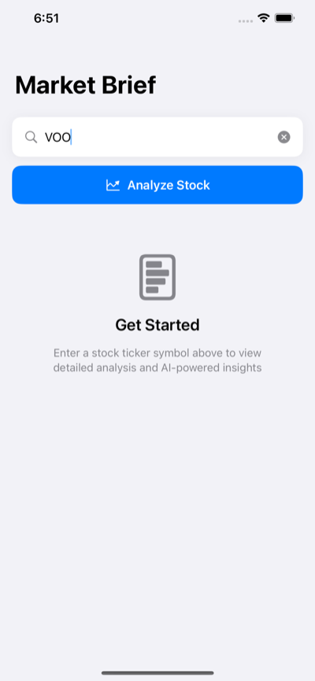
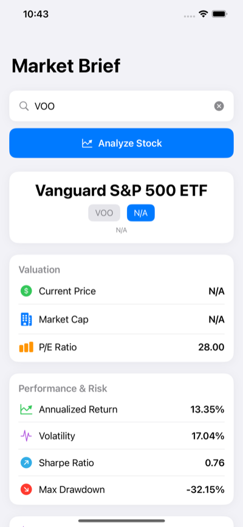
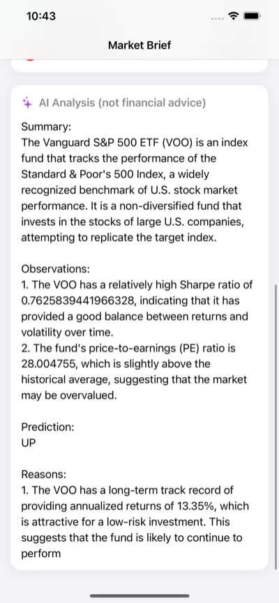

# Market Brief

*Analyst-grade equity metrics for any ticker, on your phone.*

[Download on the App Store](https://apps.apple.com/us/app/market-brief-investing/id6758671631) · [Read the case study](https://henryforrest.github.io/market-brief.html)

Most consumer investing apps stop at a price chart and a market cap. Market Brief is a small native iOS app that adds the figures a professional would look at first: Sharpe ratio, maximum drawdown, annualised return and volatility, shown alongside the live price, market capitalisation and P/E ratio. You type a ticker, the app asks a backend I built and host, and a few seconds later everything is laid out on one screen with a short AI-written commentary. I made it for retail investors who want the analyst's view without a terminal subscription or a spreadsheet, and I run the whole thing: the Swift client in this repository, the Python API and the App Store listing.

<p align="center">
  
  
  
</p>

## Features

- Ticker search with input hygiene: the field upper-cases as you type and drops anything that is not a letter, and the "Analyze Stock" button only enables for a one-to-five-letter symbol while the device is online. Submitting from the keyboard works too.
- One screen, four states: an empty prompt, a custom animated gradient ring while loading, an error card, and the result.
- Results grouped into three cards, each row with its own SF Symbol: a header (company name, ticker, sector and industry), Valuation, and Performance & Risk.
- Client-side formatting, with missing values shown as N/A rather than breaking the layout:

  | Card | Metric | Displayed as |
  | --- | --- | --- |
  | Valuation | Current price | USD to two decimals |
  | Valuation | Market cap | Abbreviated to M, B or T (for example `$1.25T`) |
  | Valuation | P/E ratio | Two decimals |
  | Performance & Risk | Annualised return | Percentage, green when positive and red when negative |
  | Performance & Risk | Volatility | Percentage |
  | Performance & Risk | Sharpe ratio | Two decimals (risk-adjusted return) |
  | Performance & Risk | Max drawdown | Percentage (worst peak-to-trough fall) |

- An AI Analysis card, labelled "not financial advice", that shows the backend's written summary or a placeholder when none is available.
- Every failure maps to a `StockError` case with a user-facing message: invalid ticker, offline, unknown ticker (404), rate limited (429), server error (5xx), TLS failure, or a response that would not decode.
- A client-side rate limiter (ten requests a minute over a sliding window) implemented as a Swift actor, so a fast tapper cannot hammer the backend; stale entries are cleared when the app returns to the foreground.
- Connectivity awareness through NWPathMonitor: an offline banner, a warning banner and alert on unrecognised network types, and the request button disabled until a connection returns.
- A toolbar action, behind a confirmation alert, that clears the current result and ticker.
- Accessibility: each metric row is a single VoiceOver element that reads as "Title: value", and the toolbar button carries a label.
- Light and dark mode via system semantic colours; the app icon ships light, dark and tinted variants. Runs on iPhone and iPad. No third-party dependencies and no analytics.

## How it works

The app is a single SwiftUI scene: `MarketBriefApp` shows `ContentView`, and everything else lives in `ContentView.swift` and the model file. It uses only SwiftUI, Foundation and the Network framework.

**Request.** Submitting the field or tapping the button calls `fetchStock()`, an `async` function on the main actor. It validates the ticker, checks connectivity, asks the `RateLimiter` actor for a slot, then builds `GET {baseURL}/stock/{TICKER}` with a JSON `Accept` header and sends it through a `URLSession` configured with a 30-second request timeout, a 60-second resource timeout and `waitsForConnectivity`. TLS validation is left to the system trust store.

**Decoding.** A 200 response is decoded with `JSONDecoder` into `StockResponse`, a `Decodable` struct in which every field is optional, so a partial payload (an ETF with no market cap, say) still renders. Other status codes are mapped to `StockError` cases, and `URLError` codes are folded into the same enum, so the view deals with one error type.

**Concurrency and state.** Swift concurrency is used throughout: `async`/`await` for the request, an `actor` for the rate limiter, and `Task { }` from the SwiftUI event handlers. View state is plain `@State` (`ticker`, `stock`, `isLoading`, `error`), and the body renders exactly one of loading, error, result or empty from those values. Connectivity is an `ObservableObject` wrapping `NWPathMonitor`, published on the main queue; a second `ObservableObject` turns `NotificationCenter` security notices into an alert. Nothing is persisted: no accounts, no favourites, no history. A result lives in memory and is discarded when its view disappears or the user clears it.

**Backend.** The numbers come from [market-brief-api](https://github.com/henryforrest/market-brief-api), a FastAPI service I run on Fly.io. `GET /stock/{ticker}` fetches the underlying market data, computes the derived metrics server-side (annualised return, volatility, Sharpe ratio and maximum drawdown) alongside price, market cap and P/E, adds an AI-written summary and returns a single JSON object. That split keeps the client thin, and the calculations live in one place where they can be corrected without an App Store release.

## Project layout

```
MarketBrief.xcodeproj/        Xcode project: iOS 18.5 target, Swift 5 language mode, shared scheme
MarketBrief/
  MarketBriefApp.swift        @main entry point; one WindowGroup showing ContentView
  ContentView.swift           The UI, plus SecurityConfig, RateLimiter, NetworkMonitor,
                              StockError, fetchStock() and the formatting helpers
  StockResponse.swift         Decodable model for the /stock/{ticker} response
  Assets.xcassets/            App icon (light, dark and tinted) and accent colour
MarketBriefTests/             Swift Testing target (scaffolding only)
MarketBriefUITests/           XCUITest target (scaffolding only)
docs/screenshots/             App Store screenshots used in this README
```

## Building

- Requires Xcode 16.4 or later: the project targets iOS 18.5 and uses the Xcode 16 project format. It was last opened with Xcode 26.2.
- Open `MarketBrief.xcodeproj`, pick the `MarketBrief` scheme and an iPhone or iPad simulator, and run. There are no packages to resolve and no keys to set; the app talks to the public backend.
- The shared scheme runs the Release configuration by default; switch the Run action to Debug in Edit Scheme if you want to step through the code.
- The backend address is the single constant `SecurityConfig.baseURL` at the top of `MarketBrief/ContentView.swift`. Change it there to point the app at a local or staging instance of market-brief-api.

## Status

Live on the App Store; the current release is 1.1.5 (build 6). A solo project: I designed, built, deployed and shipped both the client and the backend.

## Licence

Copyright © 2026 Henry Forrest. The source is published so that people can read it. No licence is granted to reuse, modify or redistribute the code, the app name or its assets.
